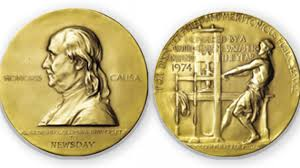
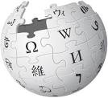

<!DOCTYPE html>
<html>
<head>
    <title>Pulitzer Award</title>
    
    <meta charset="utf-8" />
    <meta http-equiv="Content-type" content="text/html; charset=utf-8" />
    <meta name="viewport" content="width=device-width, initial-scale=1" />
</head>
<body>
    

        <h1 id="1"><ins>PULITZER AWARD</ins></h1>
        
    

    

    <h2><ins>---:Introduction:---</ins></h2>
    

        The Pulitzer Prize (/ˈpʊlɪtsər/) is an award for achievements in newspaper, magazine and online journalism, literature, and musical composition in the United States. It was established in 1917 by provisions in the will of Joseph Pulitzer, who had made his fortune as a newspaper publisher, and is administered by Columbia University.Prizes are awarded yearly in twenty-one categories. In twenty of the categories, each winner receives a certificate and a US$15,000 cash award (raised from $10,000 in 2017).The winner in the public service category is awarded a gold medal.
    

    

    <h2><ins>---:History:---</ins></h2>
    

        Newspaper publisher Joseph Pulitzer gave money in his will to Columbia University to launch a journalism school and establish the Prize. It allocated $250,000 to the prize and scholarships.[12] He specified "four awards in journalism, four in letters and drama, one in education, and four traveling scholarships."[2] After his death on October 29, 1911, the first Pulitzer Prizes were awarded June 4, 1917 (they are now announced in April). The Chicago Tribune under the control of Colonel Robert R. McCormick felt that the Pulitzer Prize was nothing more than a 'mutual admiration society' and not to be taken seriously; the paper refused to compete for the prize during McCormick's tenure up until 1961.
    

    

    <h2><ins>---:Recemt Prizes:---</ins></h2>
    

        <table border="2">
            <thead>
                <tr>
                    <th><ins>Year</ins></th>
                    <th><ins>Photographer</ins></th>
                    <th><ins>Description</ins></th>
                </tr>
            </thead>
            <tbody>
                <tr>
                    <td>2015</td>
                    <td>
                        Daniel Berehulak,The New York Times
                    </td>
                    <td>
                        for his gripping, courageous photographs of the Ebola epidemic in West Africa.
                    </td>
                </tr>
                <tr>
                    <td>2016</td>
                    <td>Jessica Rinaldi,The Boston Globe</td>
                    <td>
                        for the raw and revealing photographic story of a boy who strives to find his footing after abuse by those he trusted.
                    </td>
                </tr>
                <tr>
                    <td>2017</td>
                    <td>E. Jason Wambsgans,Chicago Tribune</td>
                    <td>
                        for a superb portrayal of a 10-year-old boy and his mother striving to put the boy’s life back together after he survived a shooting in Chicago.
                    </td>
                </tr>
                <tr>
                    <td>2018</td>
                    <td>Staff of Reuters </td>
                    <td>
                        for shocking photographs that exposed the world to the violence Rohingya refugees faced in fleeing Myanmar.
                    </td>
                </tr>
                <tr>
                    <td>2019</td>
                    <td>Lorenzo Tugnoli,The Washington Post</td>
                    <td>
                        for brilliant photo storytelling of the tragic famine in Yemen, shown through images in which beauty and composure are intertwined with devastation.
                    </td>
                </tr>
                <tr>
                    <td>2020</td>
                    <td>Dar Yasin,Associated Press</td>
                    <td>
                        Mukhtar Khan and Channi Anand "for striking images captured during a communications blackout in Kashmir depicting life in the contested territory as India stripped it of its semi-autonomy.
                    </td>
                </tr>
            </tbody>
        </table>
    

    <form action="myProject02.html">
        
<input type="submit" name="gallery" value="Gallery">
    
    </form>
    

    <h2><ins>---:More Information:---</ins></h2>
    

        &#8287;&#8287;&#8287;
        &#8287;&#8287;&#8287;
        
    
    
</body>
</html>